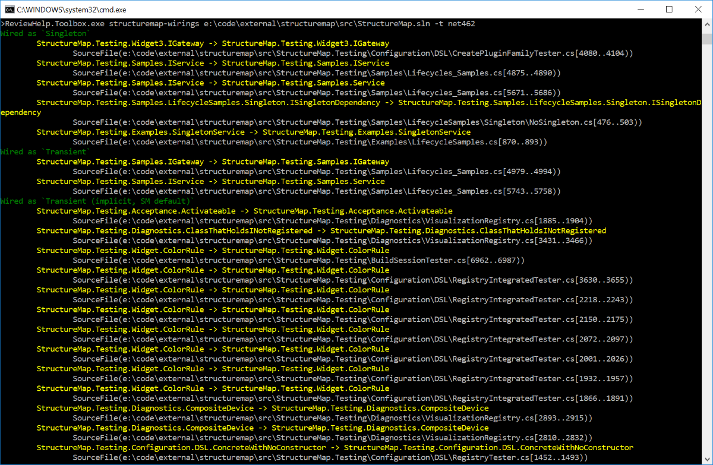

# ReviewHelp.Toolbox

Framework specific tools supplementing [ReviewHelp.Analyzers](https://github.com/jokokko/reviewhelp.analyzers), aiding in reviewing code.

Available functionality:
- Build a catalog of wired plugins and wiring lifecycles from [StructureMap](http://structuremap.github.io/) configurations. The scanning can span multiple solutions.

